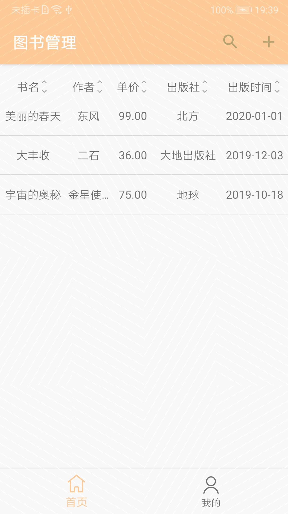

# CloudDB QuickStart


## Introduction
It's a quickstart sample demonstrating the CloudDB APIs on Android. 

## Getting Started
- Open this project by Android Studio.

- Go to [AppGallery Connect page](https://developer.huawei.com/consumer/cn/service/josp/agc/index.html#/myApp) to create your new application. Make sure your application's package name is com.huawei.agc.clouddb.xxxx.

- Go to **Auth** tab and enable **Huawei account** authentication.

- Go to **Cloud Database** tab and enable database service, and import the object type in CloudDBQuickStart_1.json under the root directory of project. Or you can create it with name **BookInfo**, and add all fields in BookInfo.java in the sample project.

- Download agconnect-services.json from **Generate view** tab, and add it under app directory.

- Add your key store to build script, see app/build.gradle. To generate an key store, you can use tool provided by Android Studio: **Build** -> **Generate signed bundle and apk** -> Choose **apk** selection, and then do as hints step by step. Then fill the password and alias name into app/build.gradle. Export the SHA256 fingerprints by keytool:

  ```
  keytool -list -v -keystore xxxx.jks
  ```

  and fill it into "SHA256 fingerprints" in **Generate view** tab.

- Run the sample on Android device. Attention: Huawei mobile service(HMS) should have been installed on your devices already.

## Result



## License

CloudDB QuickStart is licensed under the [Apache License, version 2.0](http://www.apache.org/licenses/LICENSE-2.0).