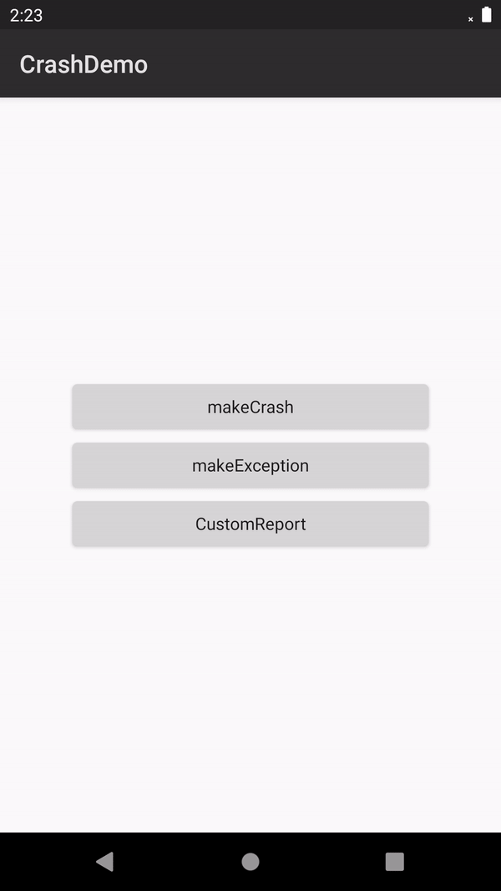

## crash quickstart

## Table of Contents

 * [Introduction](#introduction)
 * [Supported Environments](#supported-environments)
 * [Getting Started](#getting-started )
 * [Sample Code](# Sample-Code)
 * [Result](# Result)
 * [Question or issues](# question-or-issues)
 * [License](#license)

## Introduction
The AppGallery Connect Crash service provides a powerful yet lightweight solution to app crash problems. With the service, you can quickly detect, locate, and resolve app crashes (unexpected exits of apps), and have access to highly readable crash reports in real time, without the need to write any code.

## Supported Environments
* A computer with Android Studio installed for app development
* A device running Android 4.2 or a later version

## Getting Started
Before running the crash quickstart app, you need to:
1. If you do not have a HUAWEI Developer account, you need to [register an account](https://developer.huawei.com/consumer/en/doc/start/registration-and-verification-0000001053628148) and pass identity verification.
2. Use your account to sign in to [AppGallery Connect](https://developer.huawei.com/consumer/cn/doc/development/AppGallery-connect-Guides/agc-get-started), create an app, and set Package type to APK (Android app).
3. Select your project and app in My projects, and go to Quality > Crash to enable the Crash service.(The Crash service integrates HUAWEI Analysis Kit for crash event reporting. As a result, you need to enable HUAWEI Analysis Kit before integrating the Crash SDK.)
4. Select Project Settings,download the agconnect-services.json file from AppGallery Connect and copy the agconnect-services.json file to the app root directory.

## Sample Code
The Crash SDK supports crash simulation and crash collection switch setting.
Sample code: src\main\java\com\huawei\agc\quickstart\crash\MainActivity.java

## Result
**Click makeCrash and Report**

## Question or issues
If you have questions about how to use AppGallery Connect Demos, try the following options:  
* [Stack Overflow](https://stackoverflow.com/users/14194729/appgallery-connect) is the best place for any programming questions. Be sure to tag your question with huawei-mobile-services.  
* [Huawei Developer Forum](https://forums.developer.huawei.com/forumPortal/en/home?fid=0101188387844930001) AppGallery Module is great for general questions, or seeking recommendations and opinions.

## License
crash quickstart is licensed under the [Apache License, version 2.0] (http://www.apache.org/licenses/LICENSE-2.0).
