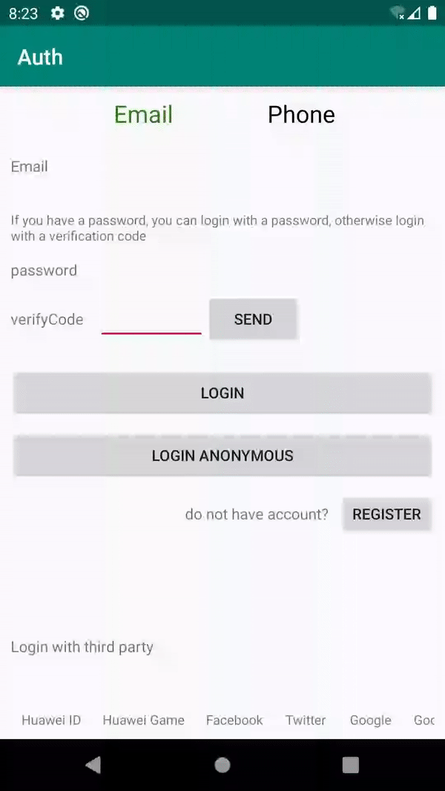
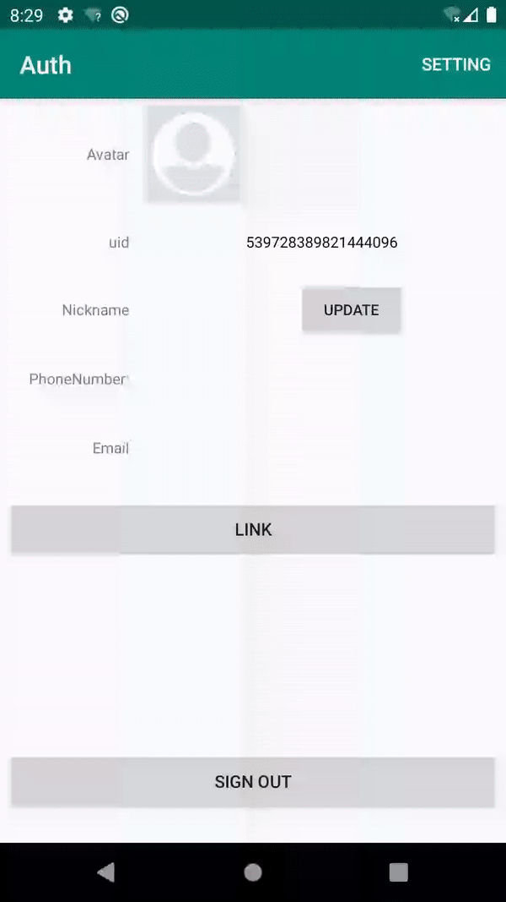

## auth quickstart

English | [中文](https://github.com/AppGalleryConnect/agc-demos/tree/main/Android/agc-authservice-demo-java/blob/master/README_ZH.md)

## Table of Contents

 * [Introduction](#introduction)
 * [Preparing the Environments](#preparing-the-environments)
 * [Getting Started](#getting-started)
 * [Sample Code](#sample-Code)
 * [Result](#result)
 * [Question or issues](#question-or-issues)
 * [License](#license)

## Introduction
Auth Service provides cloud services and the SDK to help you quickly build a secure and reliable user authentication system for your app.
Auth Service supports multiple authentication modes and is closely integrated with other serverless services, effectively protecting user data by defining simple rules.

## Preparing the Environment
* A computer with Android Studio installed for app development
* A device or emulator in Android Studio running Android 4.2 or a later version
	
## Getting Started
Before running the quickstart app, you need to:
1. If you do not have a HUAWEI Developer account, you need to register an account and pass identity verification.
2. Use your account to sign in to AppGallery Connect, create an app, and set Package type to APK (Android app).
3. Enable authentication modes.
3.1 Sign in to AppGallery Connect, select My apps, and click the product of the app for which you want to enable Auth Service.
3.2 Go to Develop > Build > Authentication service. If it is the first time that you use Authe Service, click Enable now in the upper right corner.
3.3 Click Enable in the row of each authentication mode to be enabled.
3.4 If an authentication mode requires related information, configure the information by referring to the development guide.
4. Download the agconnect-services.json file from AppGallery Connect and replace place it in the application-level root directory (for example: quickstart is auth/app/.  )
Before compiling the APK, please make sure that the project includes the agconnect-services.json file, otherwise a compilation error will occur.

## Sample Code
The quickstart app supports the following authentication modes:
1. Anonymous account
Sample code: src\main\java\com\huawei\agc\quickstart\auth\AnonymousActivity.java

2. Email address
Sample code: src\main\java\com\huawei\agc\quickstart\auth\EmailActivity.java

3. Huawei game
Sample code: src\main\java\com\huawei\agc\quickstart\auth\HWGameActivity.java

4. Huawei account
Sample code: src\main\java\com\huawei\agc\quickstart\auth\HWIDActivity.java

5. QQ
Sample code: src\main\java\com\huawei\agc\quickstart\auth\QQActivity.java
If you need to integrate QQ accounts, integrate the QQ account access SDK first (for details, please refer to https://wiki.connect.qq.com/qq%E7%99%BB%E5%BD%95).

6. Self-owned account
Sample code: src\main\java\com\huawei\agc\quickstart\auth\SelfBuildActivity.java

7. Weibo
Sample code: src\main\java\com\huawei\agc\quickstart\auth\WeiboActivity.java

8. WeChat
Sample code: src\main\java\com\huawei\agc\quickstart\auth\WeixinActivity.java

9. Facebook
Sample code: src\main\java\com\huawei\agc\quickstart\auth\FacebookActivity.java

10. Google
Sample code: src\main\java\com\huawei\agc\quickstart\auth\GoogleActivity.java

11. Google Play Games
Sample code: src\main\java\com\huawei\agc\quickstart\auth\PlayGameActivity.java

12. Twitter
Sample code: src\main\java\com\huawei\agc\quickstart\auth\TwitterActivity.java

13. Phone
Sample code: src\main\java\com\huawei\agc\quickstart\auth\PhoneActivity.java

## Result
**Login Anonymous** 

**Update DisPlayName** 

## Question or issues
If you have questions about how to use AppGallery Connect Demos, try the following options:
* [Stack Overflow](https://stackoverflow.com/users/14194729/appgallery-connect) is the best place for any programming questions. Be sure to tag your question with `AppGallery`.
* [Huawei Developer Forum](https://forums.developer.huawei.com/forumPortal/en/home?fid=0101188387844930001) AppGallery Module is great for general questions, or seeking recommendations and opinions.

If you run into a bug in our samples, please submit an [issue](https://github.com/AppGalleryConnect/agc-demos/issues) to the Repository. Even better you can submit a [Pull Request](https://github.com/AppGalleryConnect/agc-demos/pulls) with a fix.

## License
crash quickstart is licensed under the [Apache License, version 2.0] (http://www.apache.org/licenses/LICENSE-2.0).