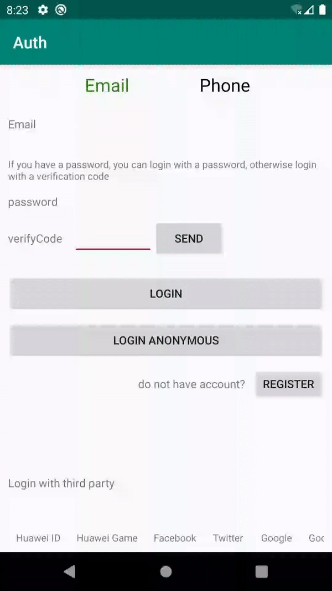

## 简介

AppGallery Connect认证服务提供了云侧服务和SDK，可以帮您为您的应用快速构建安全可靠的用户认证系统，以便您的应用可以对您的用户进行身份认证。
AppGallery Connect认证服务支持多种认证方式，并与其他Serverless服务紧密集成，您可以通过简单的规则定义来保护您的用户的数据安全。

## 环境要求

* 在使用quickstart 之前，开发者需要配置好Android开发环境
* 一台Android设备或者模拟器，需要支持Android 4.2及以上版本

## 快速入门

在运行quickstart前，您需要
1、如果没有华为开发者联盟帐号，需要先[注册账号](https://developer.huawei.com/consumer/en/doc/start/registration-and-verification-0000001053628148)并通过实名认证。
2、使用申请的帐号登录[AppGallery Connect](https://developer.huawei.com/consumer/cn/doc/development/AppGallery-connect-Guides/agc-get-started)网站创建应用，软件包类型选择“APK(Android应用)”。
3、启动认证方式：
      3.1 登录AppGallery Connect，点击“我的应用”，点击需要启动认证服务的应用所属的产品。
      3.2 点击“开发”页签，导航选择“Serverless > 认证服务”。如果首次使用认证服务，请点击“立即开通”开通服务。
      3.3 点击需要启动的认证方式所在行的“启用”。
      3.4 如果有些认证方式需要填写相关信息，请参照开发指南完成信息得配置。
 4、在AppGallery Connect网站上下载agconnect-services.json 文件，并放在应用级根目录下(例如：quickstart是auth/app/)。在编译APK之前，请确保项目中包含agconnect-services.json文件，否则会编译出错。

## 示例代码

quickstart 支持如下几种接入方式：
1. 匿名用户
代码：src\main\java\com\huawei\agc\quickstart\auth\AnonymousActivity.java

2. 电子邮件
代码：src\main\java\com\huawei\agc\quickstart\auth\EmailActivity.java

3. 华为游戏账户
代码：src\main\java\com\huawei\agc\quickstart\auth\HWGameActivity.java

4. 华为账户
代码：src\main\java\com\huawei\agc\quickstart\auth\HWIDActivity.java

5. QQ
代码：src\main\java\com\huawei\agc\quickstart\auth\QQActivity.java
如果需要集成QQ帐号，开发者可以先集成QQ帐号接入SDK（具体参考：https://wiki.connect.qq.com/qq%E7%99%BB%E5%BD%95）

6. 自建账户
代码：src\main\java\com\huawei\agc\quickstart\auth\SelfBuildActivity.java

7. 微博
代码：src\main\java\com\huawei\agc\quickstart\auth\WeiboActivity.java

8. 微信
代码：src\main\java\com\huawei\agc\quickstart\auth\WeixinActivity.java

9. Facebook
代码：src\main\java\com\huawei\agc\quickstart\auth\FacebookActivity.java

10. Google
代码：src\main\java\com\huawei\agc\quickstart\auth\GoogleActivity.java

11. Google Games
代码：src\main\java\com\huawei\agc\quickstart\auth\PlayGameActivity.java

12. Twitter
代码：src\main\java\com\huawei\agc\quickstart\auth\TwitterActivity.java

13. Phone
代码：src\main\java\com\huawei\agc\quickstart\auth\PhoneActivity.java

## 示例效果
**匿名账号登录** 

**更新用户头像** 

## 技术支持

如果您对使用AppGallery Connect示例代码有疑问，请尝试：
- 开发过程遇到问题上[Stack Overflow](https://stackoverflow.com/users/14194729/appgallery-connect)，在`AppGallery`标签下提问，有华为研发专家在线一对一解决您的问题。
- 到[华为开发者论坛](https://forums.developer.huawei.com/forumPortal/en/home?fid=0101188387844930001) AppGallery Connect板块与其他开发者进行交流。

如果您在尝试示例代码中遇到问题，请向仓库提交[issue](https://github.com/AppGalleryConnect/agc-demos/issues)，也欢迎您提交[Pull Request](https://github.com/AppGalleryConnect/agc-demos/pulls)。

## 授权许可

该示例代码经过[Apache 2.0 授权许可](http://www.apache.org/licenses/LICENSE-2.0)。

