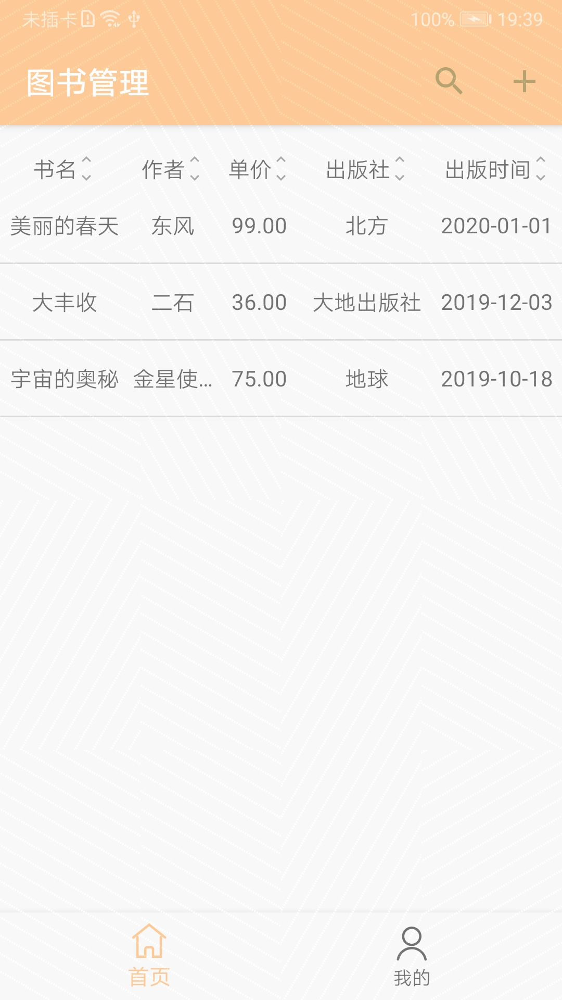

# Cloud DB Quick Start

## Introduction

This project is a quick start sample developed using Cloud DB APIs.

## Quick Start

- On the [AppGallery Connect](https://developer.huawei.com/consumer/en/service/josp/agc/index.html#/myApp) page, create a project and add an application with a package named **com.huawei.agc.clouddb.xxxx**.

- Click **Auth Service** on the navigation bar and enable authentication using an anonymous account.

- Click **Cloud DB** on the navigation bar and enable database service. Then, perform the following operations:

    (1) Create a schema by importing a template file stored in **CloudDBQuickStart_1.json** in the root directory of the project. Alternatively, create a schema named **BookInfo** and ensure that all fields must be the same as those in **BookInfo.java** in the project.

    (2) Create a Cloud DB zone. On the **Cloud DB Zone** tab page, click **Add** to create a Cloud DB zone named **QuickStartDemo**.

- Click **Project Settings** on the navigation bar, download the **agconnect-services.json** file, and add it to the app directory.

- Use Android Studio to open the project.

- Run the sample on your Android device. Note that Huawei Mobile Services (HMS) must be installed on your device.

## Running Result

## License

Cloud DB Quick Start is licensed under the [Apache License, version 2.0](http://www.apache.org/licenses/LICENSE-2.0).
