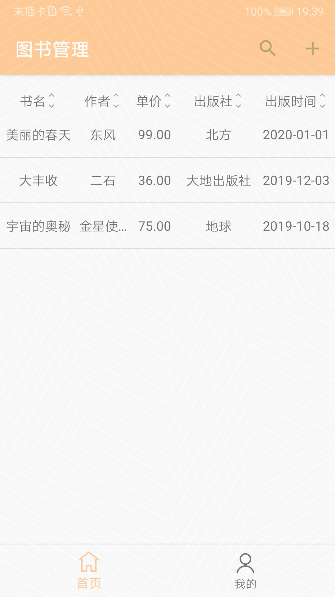

# CloudDB 快速入门

## 简介
本工程是用CloudDB APIs开发的一个入门示例。

## 快速入门
- 在[应用市场我的应用]( https://developer.huawei.com/consumer/cn/service/josp/agc/index.html#/myApp )页面新建一个项目，然后添加一个应用，应用的包名是com.huawei.agc.clouddb.xxxx

- 在**认证服务**一栏，开通**认证服务**，示例代码启用的是“**匿名帐号**”方式。

- 在**云数据库**一栏，选择开启服务，然后：

    （1）创建Schema信息。可以选择从文件导入，模板文件预放在工程根目录的CloudDBQuickStart_1.json中；也可以自己从新创建，Schema的名称必须为**BookInfo**，所有字段需要和工程中BookInfo.java的字段相同。

    （2）新建存储区。在存储区一栏，点击**新增**按钮新建一个存储区，示例代码使用的名称是“QuickStartDemo”。

- 从**项目设置**栏下载agconnect-services.json文件，添加到app目录下。

- 用Android Studio打开工程。

- 在你的安卓设备上运行示例。

## 运行效果图

## 许可证

CloudDB QuickStart is licensed under the [Apache License, version 2.0](http://www.apache.org/licenses/LICENSE-2.0).