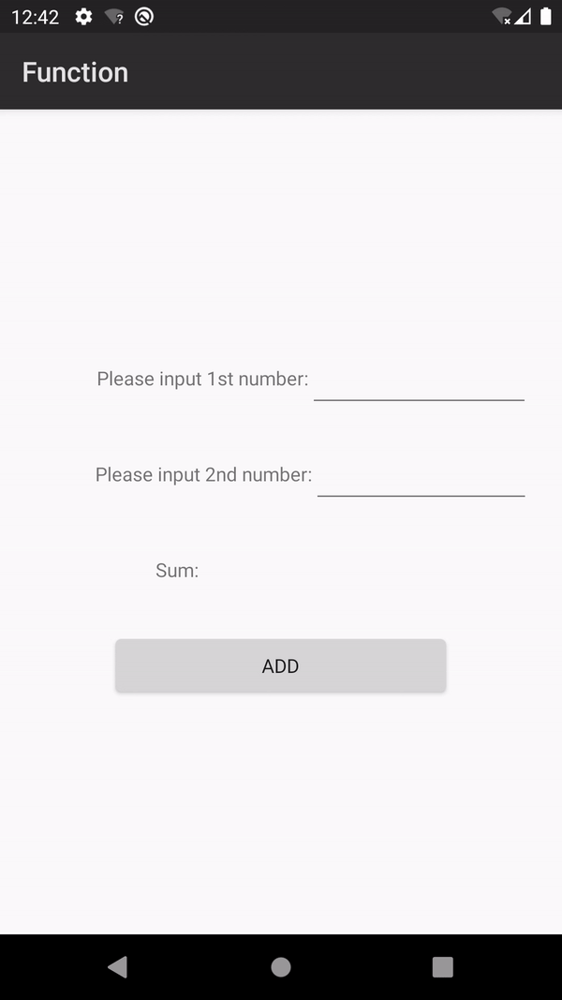

## function quickstart

English | [中文](https://github.com/AppGalleryConnect/agc-demos/blob/main/Android/cloudfunction/README_ZH.md)

## Table of Contents

 * [Introduction](#introduction)
 * [Preparing the Environments](#preparing-the-environments)
 * [Getting Started](#getting-started)
 * [Sample Code](#sample-Code)
 * [Result](#result)
 * [Question or issues](#question-or-issues)
 * [License](#license)

## Introduction
Cloud Functions enables serverless computing. It provides the Function as a Service (FaaS) capabilities to simplify app development and O&M so your ideas can be realized more easily and your service capabilities can be built more quickly.
1. Cloud Functions provides an efficient and reliable framework for developing and running functions. It frees you from complex traditional development and O&M of apps. Server configuration and management, code deployment, load balancing, autoscaling, and high reliability assurance are now streamlined.
You only need to focus on service logic and function code to build reliable and scalable serverless apps.
2. As the core of serverless computing, Cloud Functions works with other cloud services like building blocks to implement your service logic.

## Preparing the Environment
* A computer with Android Studio installed for app development
* A device or emulator in Android Studio running Android 4.2 or a later version

## Getting Started
Before running the quickstart app, you need to:
1. If you do not have a HUAWEI Developer account, you need to register an account and pass identity verification.
2. Use your account to sign in to AppGallery Connect, create an app, and set Package type to APK (Android app).
3. Create a cloud function. (For details, please refer to the development guide.)
3.1 Sign in to AppGallery Connect, select My apps, and click the product of the app for which you want to enable Auth Service.
3.2 Go to Develop > Build > Cloud functions. The Cloud Functions page is displayed.
3.3 Click New Function on the Functions page.
3.4 Define the function on the page that is displayed.
3.5 Click Save.
4. Download the agconnect-services.json file from AppGallery Connect and replace place it in the application-level root directory (for example: quickstart is function/app/.)
Before compiling the APK, please make sure that the project includes the agconnect-services.json file, otherwise a compilation error will occur.

## Sample Code
The SDK can call cloud functions and send back the result.
Sample code: src\main\java\com\huawei\agc\quickstart\MainActivity.java

## Result
**Call cloud function** 

## Question or issues
If you have questions about how to use AppGallery Connect Demos, try the following options:
* [Stack Overflow](https://stackoverflow.com/users/14194729/appgallery-connect) is the best place for any programming questions. Be sure to tag your question with `AppGallery`.
* [Huawei Developer Forum](https://forums.developer.huawei.com/forumPortal/en/home?fid=0101188387844930001) AppGallery Module is great for general questions, or seeking recommendations and opinions.

If you run into a bug in our samples, please submit an [issue](https://github.com/AppGalleryConnect/agc-demos/issues) to the Repository. Even better you can submit a [Pull Request](https://github.com/AppGalleryConnect/agc-demos/pulls) with a fix.

## License
crash quickstart is licensed under the [Apache License, version 2.0] (http://www.apache.org/licenses/LICENSE-2.0).
