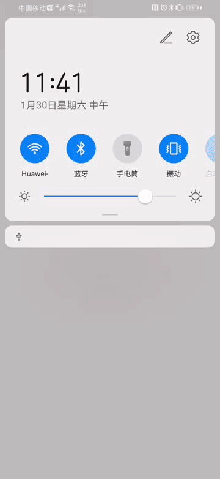

## Cloud functions quickstart

## Table of Contents

 * [Introduction](#introduction)
 * [Preparing the Environments](#preparing-the-environments)
 * [Getting Started](#getting-started)
 * [Sample Code](#sample-Code)
 * [Result](#result)
 * [Question or issues](#question-or-issues)
 * [License](#license)
 * [Remarks](#Remarks)
 
## Introduction
Cloud Functions enables serverless computing. It provides the Function as a Service (FaaS) capabilities to simplify app development and O&M so your functions can be implemented more easily and your service capabilities can be built more quickly.

## Preparing the Environments
* A computer with Huawei QuickApp IDE
* A device can run QuickApp

## Getting Started
Before running the cloud functions quickstart, you need to:
1. If you do not have a HUAWEI Developer account, you need to [register an account](https://developer.huawei.com/consumer/en/doc/start/registration-and-verification-0000001053628148) and pass identity verification.
2. Use your account to sign in to [AppGallery Connect](https://developer.huawei.com/consumer/en/doc/development/AppGallery-connect-Guides/agc-get-started), create a project and add an app, set app platform to Quick App.
3. Select your project and app in My projects, and go to Build > Cloud Functions to enable the Cloud Functions.
4. Go to General information, download the agconnect-services.json file from AppGallery Connect, replace [agconnect-services.json](./agconnect-services.json) in this demo with agconnect-services.json file.
5. Select your project and app in My projects, and go to Build > Cloud Functions, [create a function and an HTTP trigger.](https://developer.huawei.com/consumer/en/doc/development/AppGallery-connect-Guides/agc-cloudfunction-appcall-web)
6. Run the following code in terminal in the demo path, and demo will start.
    ``` 
    # install dependencies
    npm install
    
    # install AGC cloud functions sdk
    npm install @agconnect/function
    
    # run demo
    Ctrl+Shift+R
    ```
7. Input your HTTP trigger and request body in the demo and click run.
8. More details about [Cloud Functions](https://developer.huawei.com/consumer/en/doc/development/AppGallery-connect-Guides/agc-cloudfunction-appcall-quickapp)

## Sample Code

Sample code: src\Function\function.ux

## Result

**cloudfunctionsDemo**</br>


## Question or issues

If you have questions about how to use AppGallery Connect Demos, try the following options:
* [Stack Overflow](https://stackoverflow.com/) is the best place for any programming questions. Be sure to tag your question with `AppGallery`.
* [Huawei Developer Forum](https://forums.developer.huawei.com/forumPortal/en/home) AppGallery Module is great for general questions, or seeking recommendations and opinions.

If you run into a bug in our samples, please submit an [issue](https://github.com/AppGalleryConnect/agc-demos/issues) to the Repository. Even better you can submit a [Pull Request](https://github.com/AppGalleryConnect/agc-demos/pulls) with a fix.

## License
cloud functions quickstart is licensed under the [Apache License, version 2.0](http://www.apache.org/licenses/LICENSE-2.0).

##Remarks
When you create a serverless fast app with the Huawei fast application IDE, the directory structure of this demo corresponds to the client directory of serverless fast app.