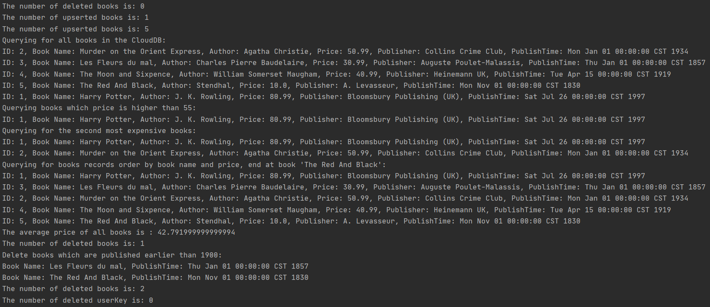

# Cloud DB Java Server SDK Demo

## Introduction

This project is a quick start sample developed using Cloud DB Java Server SDK.

## Quick Start

- On the [AppGallery Connect](https://developer.huawei.com/consumer/en/service/josp/agc/index.html#/myApp) page, create a project and add an application with a package named **com.huawei.agc.clouddb.xxxx**.

- Click **Cloud DB** on the navigation bar and enable database service. Then, perform the following operations:

    (1) Create a schema by importing a template file stored in **CloudDBQuickStart_1.json** in the root directory of the project. Alternatively, create a schema named **BookInfo** and ensure that all fields must be the same as those in **BookInfo.java** in the project.

    (2) Create a Cloud DB zone. On the **Cloud DB Zone** tab page, click **Add** to create a Cloud DB zone named **QuickStartDemo**.

- Click **Project Settings** on the navigation bar, then click **Server SDK** on the top navigation bar. Click **Create** button on API client, and download the **agc-apiclient-xxxx.json** file by clicking **Download credential** button, and add it to the app directory. Copy the path of credential file and paste it to **CloudDBZoneWrapper.java**  CloudDBZoneWrapper() constructor.  
```java
public CloudDBZoneWrapper() {
    try {
        /*
         * To Integrate the server sdk, a credential file should be used.
         * Change the value of 'credentialPath' to the path of the credential file.
         * */
        String credentialPath = "/path/agc-apiclient-xxx-xxx.json";
        AGCClient.initialize(AGCParameter.builder()
                .setCredential(CredentialParser.toCredential(credentialPath))
                .build());
        CloudDBZoneConfig cloudDBZoneConfig = new CloudDBZoneConfig("QuickStartDemo");
        agConnectCloudDB = AGConnectCloudDB.getInstance();
        mCloudDBZone = agConnectCloudDB.openCloudDBZone(cloudDBZoneConfig);
    } catch (AGCException e) {
        System.out.println("Constructor: " + e.getMessage());
    }
}
```
- Open **App.java** and run this file to start the project.

## Running Result



## License

Cloud DB Quick Start is licensed under the [Apache License, version 2.0](http://www.apache.org/licenses/LICENSE-2.0).
