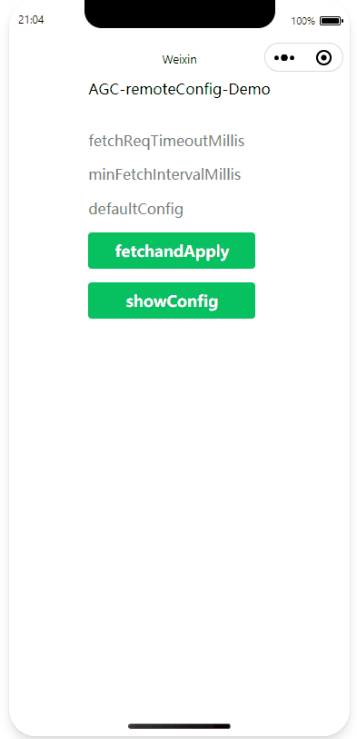

## 远程配置快速入门

中文 | [English](./README.md)

## 目录

 * [简介](#简介)
 * [环境要求](#环境要求)
 * [快速入门](#快速入门)
 * [示例代码](#示例代码)
 * [示例效果](#示例效果)
 * [技术支持](#技术支持)
 * [授权许可](#授权许可)

## 简介
您如果想打造一个出色的应用取得商业成功，需要持续为用户提供新鲜内容、新鲜功能，快速响应用户不断变化的需求和体验喜好，需要尽可能地为不同的目标用户提供差异化的用户体验。使用AppGallery Connect（简称AGC）的远程配置，您的应用即可无需升级，也可以在云端灵活修改应用的行为和外观，从而快速响应用户的需求。

## 环境要求
* 一台安装了微信开发者工具的计算机

## 快速入门
在运行quickstart前，您需要
1. 如果没有华为开发者联盟帐号，需要先[注册账号](https://developer.huawei.com/consumer/cn/doc/start/registration-and-verification-0000001053628148) 并通过实名认证。
2. 使用申请的帐号登录[AppGallery Connect](https://developer.huawei.com/consumer/cn/service/josp/agc/index.html#/) 网站创建一个项目并添加应用，软件包类型选择“Web”。
3. 在我的项目中进入新建的项目，选择创建的Web应用，进入“增长”>“远程配置”页面，点击“立即开通”，开启远程配置。
4. 点击“项目设置”>“API管理”，开启Remote Configuration。
5. 点击“常规”，复制SDK代码片段并粘贴到[index.ts](./pages/index/index.ts) 。
6. 回到“增长”>“远程配置”页面，[设置云端配置项](https://developer.huawei.com/consumer/en/doc/development/AppGallery-connect-Guides/agc-remoteconfig-web-cloudconfig-0000001056699160)
7. 在命令行中依次运行如下命令并运行demo, 使用demo您可以[获取云端配置](https://developer.huawei.com/consumer/en/doc/development/AppGallery-connect-Guides/agc-remoteconfig-web-obtainconfig-0000001056621220).
    ```
    # 安装 AGC remote config sdk
    npm install @agconnect/remoteconfig@1.3.1 --save
    ```
8. 更多详情请点击[Remote Config](https://developer.huawei.com/consumer/en/doc/development/AppGallery-connect-Guides/agc-remoteconfig-web-getstarted-0000001056501223)

## 示例代码

Sample code: /pages/index/index.ts

## 示例效果

**remoteconfigDemo**</br>


## 技术支持

如果您对使用AppGallery Connect示例代码有疑问，请通过如下途径寻求帮助：
- 访问[Stack Overflow](https://stackoverflow.com/) , 在`AppGallery`标签下提问，有华为研发专家在线一对一解决您的问题。
- 访问[华为开发者论坛](https://forums.developer.huawei.com/forumPortal/en/home) AppGallery Connect板块与其他开发者进行交流。

如果您在尝试示例代码中遇到问题，请向仓库提交[issue](https://github.com/AppGalleryConnect/agc-demos/issues) ，也欢迎您提交[Pull Request](https://github.com/AppGalleryConnect/agc-demos/pulls) 。

## 授权许可
该示例代码经过[Apache 2.0 授权许可](http://www.apache.org/licenses/LICENSE-2.0) 。
