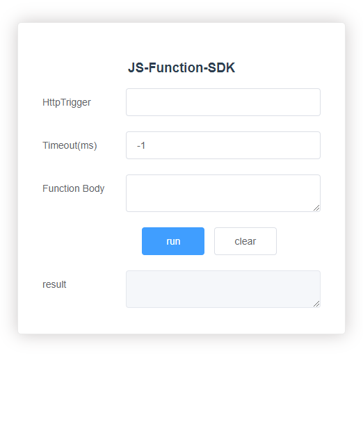

## 云函数快速入门

中文 | [English](./README.md)

## 目录

 * [简介](#简介)
 * [环境要求](#环境要求)
 * [快速入门](#快速入门)
 * [示例代码](#示例代码)
 * [示例效果](#示例效果)
 * [技术支持](#技术支持)
 * [授权许可](#授权许可)

## 简介
云函数是一项Serverless计算服务，提供FaaS（Function as a Service）能力，可以帮助开发者大幅简化应用开发与运维相关的事务，降低应用功能的实现门槛，快速构建业务能力。

## 环境要求
* 一台可以编译运行Vue项目的计算机

## 快速入门
在运行quickstart前，您需要
1. 如果没有华为开发者联盟帐号，需要先[注册账号](https://developer.huawei.com/consumer/cn/doc/start/registration-and-verification-0000001053628148) 并通过实名认证。
2. 使用申请的帐号登录[AppGallery Connect](https://developer.huawei.com/consumer/cn/service/josp/agc/index.html#/) 网站创建一个项目并添加应用，软件包类型选择“Web”。
3. 在我的项目中进入新建的项目，选择创建的Web应用，进入“构建”>“云函数”页面，点击“立即开通”，开启云函数。
4. 点击“项目设置”>“常规”，复制SDK代码片段并粘贴到[config.js](./src/components/config.js) 。
5. 回到“构建”>“云函数”页面，[创建函数并添加触发器](https://developer.huawei.com/consumer/cn/doc/development/AppGallery-connect-Guides/agc-cloudfunction-appcall-web)
6. 在命令行中依次运行如下命令以运行demo：
    ```
    # 安装依赖
    npm install

    # 安装 AGC cloud functions sdk
    npm install @agconnect/function@1.3.1 --save

    # 启动demo
    npm start
    ```
7. 在demo中输入触发器和请求体后即可运行云函数。
8. 更多详情请点击[Cloud Functions](https://developer.huawei.com/consumer/en/doc/development/AppGallery-connect-Guides/agc-cloudfunction-appcall-web)

## 示例代码

Sample code: src\components\*

## 示例效果



## 技术支持

如果您对使用AppGallery Connect示例代码有疑问，请通过如下途径寻求帮助：
- 访问[Stack Overflow](https://stackoverflow.com/) , 在`AppGallery`标签下提问，有华为研发专家在线一对一解决您的问题。
- 访问[华为开发者论坛](https://forums.developer.huawei.com/forumPortal/en/home) AppGallery Connect板块与其他开发者进行交流。

如果您在尝试示例代码中遇到问题，请向仓库提交[issue](https://github.com/AppGalleryConnect/agc-demos/issues) ，也欢迎您提交[Pull Request](https://github.com/AppGalleryConnect/agc-demos/pulls) 。

## 授权许可
该示例代码经过[Apache 2.0 授权许可](http://www.apache.org/licenses/LICENSE-2.0) 。

