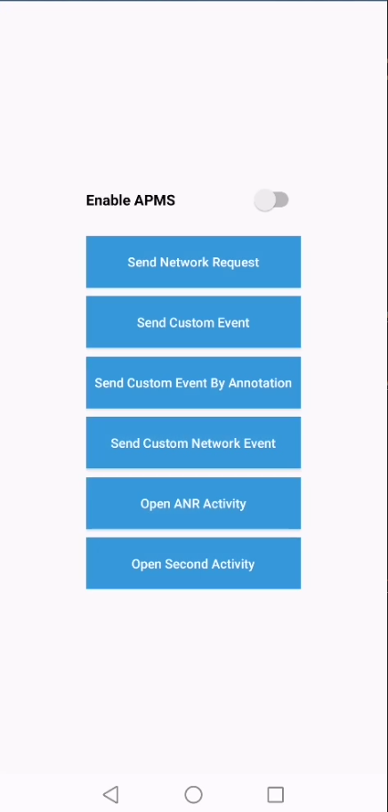

## AGC APM Xamarin Plugin - Demo

App Performance Management (APM) of HUAWEI AppGallery Connect provides minute-level app performance monitoring capabilities. You can view and analyze app performance data collected by APM to comprehensively understand online performance of apps in real time, helping you quickly and accurately rectify app performance problems and continuously improve user experience.

##  Introduction

Demo projects is an example to demonstrate the features of the AGC Apms Xamarin Plugin in iOS and Android platforms.

##  Installation Guide

**Apms** packages for both Xamarin.Android and Xamarin.iOS is available on NuGet.

- **iOS** 
   - [iOS instructions.](ios/README.md) 
   -  NuGet Official Release: 

- **Android** 
   - [Android instructions.](android/README.md) 
   -  NuGet Official Release: 

 
## Platform Support

|Platform|Version|
| ------------------- | :------------------: |
|Xamarin.iOS|iOS 9+| 
|Xamarin.Android|API 17+| 

##  Sample Project

You can find the demo applications demonstrating how to use the AGC Apms on the [HUAWEI Developer website](https://developer.huawei.com/consumer/en/doc/development/AppGallery-connect-Guides/agc-introduction).

## Licencing and Terms

AGC APM Xamarin Plugin uses the Apache 2.0 license.