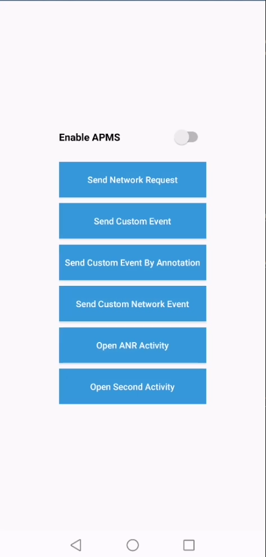

## AGC APM Xamarin Android Plugin - Demo

##  Introduction

This demo project is an example to demonstrate the features of the AGC APM Xamarin Android Plugin.

## Installation 

In the Solution Explorer panel, right click on the solution name and select Manage NuGet Packages. Search for [Huawei.Agconnect.Apms](https://www.nuget.org/packages/Huawei.Agconnect.Apms) and install the package into your Xamarin.Android projects.

### Environment Setting

Before using the Xamarin SDK code, ensure that the below environments are set:

 - Visual Studio - The latest version of Visual Studio should be installed and configured on the development computer. 

### Enable APM Services

Sign in to [AppGallery Connect](https://developer.huawei.com/consumer/en/service/josp/agc/index.html) and select your project from **My Projects**. Go to  **Quality** > **APM**. If it is the first time that you use APM, click Enable.

### Place your agconnect-services.json file inside the project

**Step 1:** Sign in to [AppGallery Connect](https://developer.huawei.com/consumer/en/service/josp/agc/index.html) and select your project from **My Projects**. 
Then go to **Project Settings** tab. On the page that is displayed, click `agconnect-services.json` button.

**Step 2:** Once you download your `agconnect-services.json` file, add it under the of the Assets folder.

### Run & debug your application

You can now run your application and it should automatically start up on your mobile device.

## 4. Licensing and Terms

AGC APM Xamarin Android Plugin - Demo uses the Apache 2.0 license.