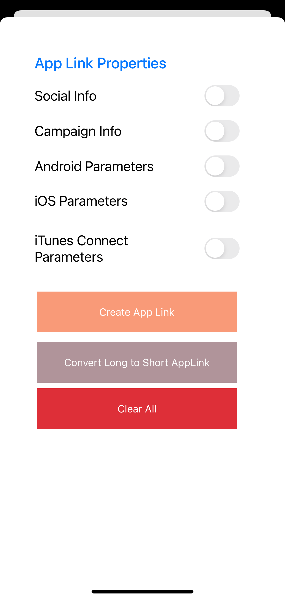

# AGC App Linking Xamarin Plugin

[App Linking](https://developer.huawei.com/consumer/en/doc/development/AppGallery-connect-Guides/agc-applinking-introduction-0000001054143215) allows you to create cross-platform links that can work as defined regardless of whether your app has been installed by a user. When a user taps the link on an Android or iOS device, the user will be redirected to the specified in-app content. If a user taps the link in a browser, the user will be redirected to the same content of the web version.

##  Introduction

Demo projects is an example to demonstrate the features of the AGC App Linking Xamarin Plugin in iOS and Android platforms.

##  Installation Guide

**Applinking** packages for both Xamarin.Android and Xamarin.iOS is available on NuGet.

- **iOS** 
   - [iOS instructions.](ios/README.md) 
   -  NuGet Official Release: 

- **Android** 
   - [Android instructions.](android/README.md) 
   -  NuGet Official Release: 

## Platform Support

|Platform|Version|
| ------------------- | :------------------: |
|Xamarin.iOS|iOS 8+|
|Xamarin.Android|API 14+|

##  Sample Project

You can find the demo applications demonstrating how to use the AGC App Linking on the [HUAWEI Developer website](https://developer.huawei.com/consumer/en/doc/development/AppGallery-connect-Guides/agc-introduction).

## Licencing and Terms

AGC App Linking Xamarin Plugin uses the Apache 2.0 license.