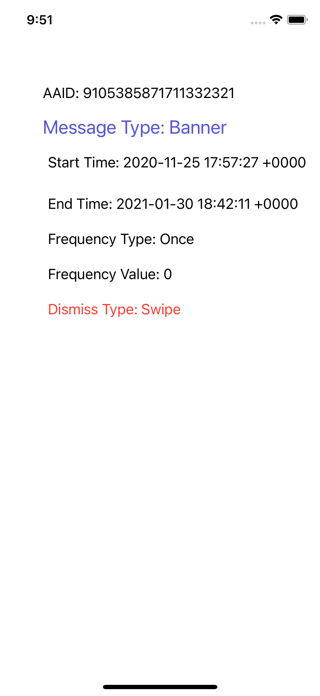

## AGC App Messaging Xamarin Plugin - Demo

[App Messaging](https://developer.huawei.com/consumer/en/doc/development/AppGallery-connect-Guides/agc-appmessage-introduction) of AppGallery Connect can be used to send relevant messages to target users actively using your app to encourage them to use key app functions. For example, you can send in-app messages to encourage users to subscribe to certain products, provide tips on passing a game level, or recommend activities of a restaurant.

App Messaging even allows you to customize how your messages look and the way they will be sent, and define events for triggering message sending to your users at the right moment.

##  Introduction

Demo projects is an example to demonstrate the features of the AGC App Messaging Xamarin Plugin in iOS and Android platforms.

##  Installation Guide

**Appmessaging** packages for both Xamarin.Android and Xamarin.iOS is available on NuGet.

- **iOS** 
   - [iOS instructions.](ios/README.md) 
   -  NuGet Official Release: 

- **Android** 
   - [Android instructions.](android/README.md) 
   -  NuGet Official Release: 

 
## Platform Support

|Platform|Version|
| ------------------- | :------------------: |
|Xamarin.iOS|iOS 8+| 
|Xamarin.Android|API 14+| 

##  Sample Project

You can find the demo applications demonstrating how to use the AGC App Linking on the [HUAWEI Developer website](https://developer.huawei.com/consumer/en/doc/development/AppGallery-connect-Guides/agc-introduction).

## Licencing and Terms

AGC App Linking Xamarin Plugin uses the Apache 2.0 license.