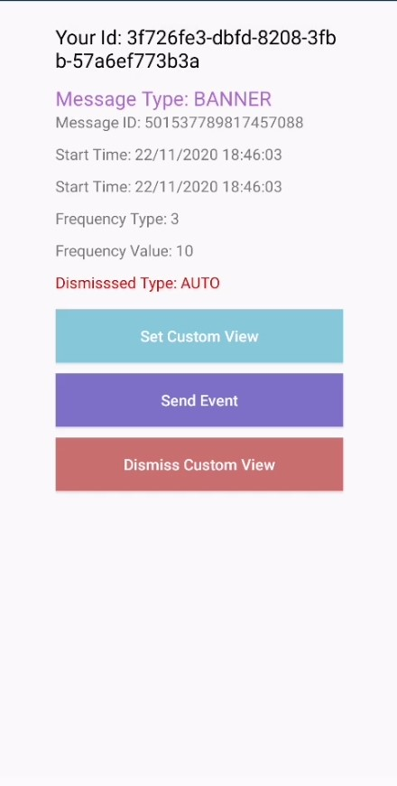

## AGC App Messaging Xamarin Android Plugin - Demo

##  Introduction

This demo project is an example to demonstrate the features of the AGC App Messaging Xamarin Android Plugin.



## Installation

In the Solution Explorer panel, right click on the solution name and select Manage NuGet Packages. Search for [Huawei.Agconnect.Appmessaging](https://www.nuget.org/packages/Huawei.Agconnect.Appmessaging) and install the package into your Xamarin.Android projects.

### Place your agconnect-services.json file inside the project

**Step 1:** Sign in to [AppGallery Connect](https://developer.huawei.com/consumer/en/service/josp/agc/index.html) and select your project from **My Projects**. 
Then go to **Project Settings** tab. On the page that is displayed, click `agconnect-services.json` button.

**Step 2:** Once you download your `agconnect-services.json` file, place it under the **Assets** folder of the demo project.

**Step 3:** Package name in the `agconnect-services.json` and the package name in the **AndroidManifest.xml** file should be same

### Environment Setting

- Android 4.4 KitKat (API level 19) and later versions

- A minimum version of Visual Studio 2019 16.3 or Visual Studio for Mac 2019 8.3 are required to build and compile

## Configuration

### Android Manifest Merging

In AGConnect Services, we were seeing AndroidManifest.xml files from multiple .aar's which contained ```<application><service android:name><metadata ... /></service></application>``` elements where the service name was the same in different files but each contain their own metadata elements. The ending result is need to be a single service element with all the metadata elements from each aar's manifest file. Otherwise AGConnect Services cannot work properly.

Xamarin.Android includes an option to use the same Android manifest merger tool that Android Studio uses to merge AndroidManifest.xml files. 

To enable this for your project, set the $(AndroidManifestMerger) MSBuild property to manifestmerger.jar in the .csproj file:

```xml
<PropertyGroup>
  <AndroidManifestMerger>manifestmerger.jar</AndroidManifestMerger>
</PropertyGroup>
```

So when building your app, the  **AndroidManifestMerger** property  merges all manifest files into a single manifest file that's packaged into your APK.

### Testing an In-App Message

In-app messages can only be displayed to users who have installed your officially released app version. App Messaging allows you to test an in-app message when your app is still under tests. 

The testing process is as follows:

**Step 1:** Obtain the anonymous application identifier (AAID) of the test device. 

**Step 2:** Sign in to [AppGallery Connect](#https://developer.huawei.com/consumer/en/service/josp/agc/index.html) and click **My projects**.

**Step 3.:** Go to **Growing > App Messaging > Management**, find the message that you need to test, and click Test in the Operation column.

**Step 4.:** Click **Add test user** on the **Test app message** page and enter the AAID of the test device in the text box.

**Step 5.:** Click **Save** to set the in-app message to a test message and save the device as a test device.

**Step 6.:** Enable in app message testing for your app by calling the **SetForceFetch** API in the testing code to specify that the in-app message data must be obtained from the AppGallery Connect server by force.

```csharp
AGConnectAppMessaging.Instance.SetForceFetch();
```

After the SetForceFetch API is called, when a trigger event takes place next time, in-app message data will be obtained from the AppGallery Connect server by force and test device information will also be obtained. 

### Run & debug your application
You can now run your application and it should automatically start up on your mobile device.


## 4. Licensing and Terms
AGC App Messaging Xamarin Android Plugin - Demo uses the Apache 2.0 license.