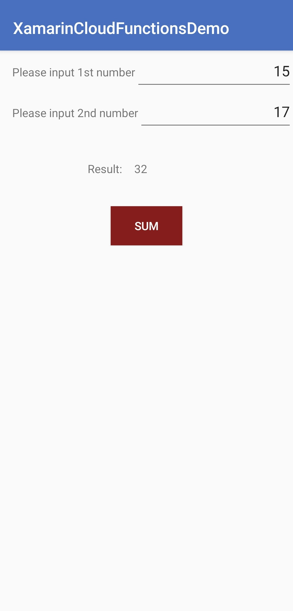

# AGC Cloud Functions Xamarin Android Plugin - Demo

##  Introduction

This demo project is an example to demonstrate the features of the AGC Cloud Functions Xamarin Android Plugin.



## Installation

In the Solution Explorer panel, right click on the solution name and select Manage NuGet Packages. Search for [Huawei.Agconnect.Function](https://www.nuget.org/packages/Huawei.Agconnect.Function) and install the package into your Xamarin.Android projects.

### Enable Cloud Functions

Sign in to [AppGallery Connect](https://developer.huawei.com/consumer/en/service/josp/agc/index.html) and select your project from **My Projects**. Go to  **Build** > **Cloud Functions**. If it is the first time that you use Cloud Functions, click Enable now in the upper right corner.

### Create a Cloud Function

(For details, please refer to the development guide.)

- Sign in to [AppGallery Connect](https://developer.huawei.com/consumer/en/service/josp/agc/index.html) and select your project from **My Projects**. 
- Go to Develop > Build > Cloud functions. The Cloud Functions page is displayed.
- Click New Function on the Functions page.
- Define the function on the page that is displayed. 
- Click Save.

### Place your agconnect-services.json file inside the project

**Step 1:** Sign in to [AppGallery Connect](https://developer.huawei.com/consumer/en/service/josp/agc/index.html) and select your project from **My Projects**. Then go to **Project Settings** tab. On the page that is displayed, click `agconnect-services.json` button.

**Step 2:** Once you download your `agconnect-services.json` file, place it under the **Assets** folder of the demo project.

**Step 3:** Package name in the `agconnect-services.json` and the package name in the **AndroidManifest.xml** file should be matched.

### Environment Setting

- Android 4.2 (API level 17) and later versions

- A minimum version of Visual Studio 2019 16.3 or Visual Studio for Mac 2019 8.3 are required to build and compile

## Configuration

### Android Manifest Merging

In AGConnect Services, we were seeing AndroidManifest.xml files from multiple .aar's which contained ```<application><service android:name><metadata ... /></service></application>``` elements where the service name was the same in different files but each contain their own metadata elements. The ending result is need to be a single service element with all the metadata elements from each aar's manifest file. Otherwise AGConnect Services cannot work properly.

Xamarin.Android includes an option to use the same Android manifest merger tool that Android Studio uses to merge AndroidManifest.xml files. 

To enable this for your project, set the $(AndroidManifestMerger) MSBuild property to manifestmerger.jar in the .csproj file:

```xml
<PropertyGroup>
  <AndroidManifestMerger>manifestmerger.jar</AndroidManifestMerger>
</PropertyGroup>
```

So when building your app, the  **AndroidManifestMerger** property  merges all manifest files into a single manifest file that's packaged into your APK.

## Run & debug your application

You can now run your application and it should automatically start up on your mobile device.

## Licensing and Terms

AGC Cloud Functions Xamarin Android Plugin - Demo is licensed under [Apache 2.0 license](LICENSE)