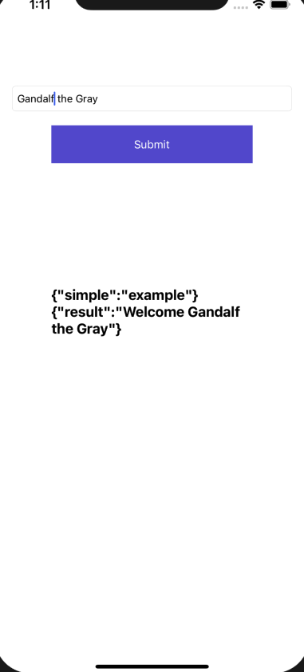

## AGC Cloud Functions Xamarin iOS Plugin - Demo

##  Introduction

This demo project is an example to demonstrate the features of the AGC Cloud Functions Xamarin iOS Plugin.

## Installation 

In the Solution Explorer panel, right click on the solution name and select Manage NuGet Packages. Search for [Huawei.Agconnect.iOS.Function](https://www.nuget.org/packages/Huawei.Agconnect.iOS.Function) and install the package into your Xamarin.Android projects.

### Environment Setting

Before using the Xamarin SDK code, ensure that the below environments are set:

 - Visual Studio for Mac or Visual Studio - The latest version of Visual Studio for Mac or Visual Studio should be installed and configured on the development computer. 
  - A Mac with macOS High Sierra 10.13 or above required for developing a Xamarin.iOS application, and when using Visual Studio you must be connected to a Xamarin.iOS build host.
  - Xcode and iOS SDK - Apple's Xcode and the latest iOS API need to be installed and configured on the developer's computer. The latest stable version is usually recommended.
 - An Apple ID. If you don't have an Apple ID already you can create a new one at https://appleid.apple.com. It's necessary to have an Apple ID for installing and signing into Xcode.

### Enable Cloud Functions

Sign in to [AppGallery Connect](https://developer.huawei.com/consumer/en/service/josp/agc/index.html) and select your project from **My Projects**. Go to  **Build** > **Cloud Functions**. If it is the first time that you use Cloud Functions, click Enable now in the upper right corner.

### Place your agconnect-services.plist file inside the project

**Step 1:** Sign in to [AppGallery Connect](https://developer.huawei.com/consumer/en/service/josp/agc/index.html) and select your project from **My Projects**. 
Then go to **Project Settings** tab. On the page that is displayed, click `agconnect-services.plist` button.

**Step 2:** Once you download your `agconnect-services.plist` file, place it under the root of the demo project. And set the build action as **"BundleResource"**.

**Step 3:** Bundle identifier in the `agconnect-services.plist` and the  **Info.plist** file should be the same.

### Run & debug your application

You can now run your application and it should automatically start up on your mobile device.

## 4. Licensing and Terms

AGC Cloud Functions Xamarin iOS Plugin - Demo uses the Apache 2.0 license.