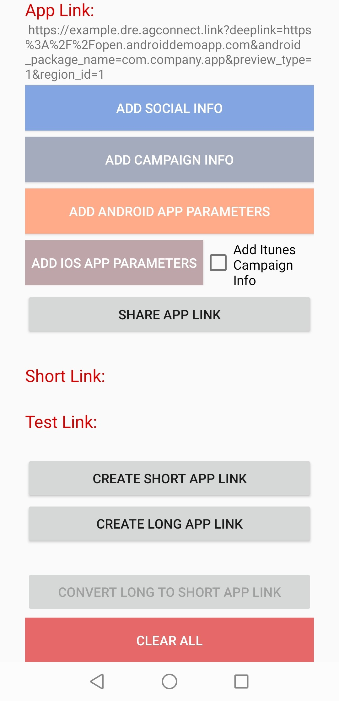

## AGC App Linking Xamarin Android Plugin - Demo

##  Introduction

This demo project is an example to demonstrate the features of the AGC App Linking Xamarin Android Plugin.



## Installation

**Huawei.Agconnect.Applinking** is available on [NuGet](https://www.nuget.org/packages/Huawei.Agconnect.Applinking). 

In the Solution Explorer panel, right click on the solution name and select Manage NuGet Packages. Search for [Huawei.Agconnect.Applinking](https://www.nuget.org/packages/Huawei.Agconnect.Applinking) and install the package into your Xamarin.Android projects.

### Enabling App Linking 

**Step 1:** Sign in to [AppGallery Connect](https://developer.huawei.com/consumer/en/service/josp/agc/index.html) and select your project from **My Projects**.  Then go to **Grow > App Linking** tab. On the page that is displayed, click Enable now in the upper right corner.

**Step 2:** The App Linking service uses HUAWEI Analytics to automatically collects and analyzes data about users' taps on App Linking. As long as your app integrates HUAWEI Analytics Kit and the App Linking SDK, you can view all relevant analytical data in AppGallery Connect. For details, please refer to [Enabling HUAWEI Analytics](#https://developer.huawei.com/consumer/en/doc/development/HMSCore-Guides/service-enabling-0000001050745155). 

### Place your agconnect-services.json file inside the project

**Step 1:** Sign in to [AppGallery Connect](https://developer.huawei.com/consumer/en/service/josp/agc/index.html) and select your project from **My Projects**. 
Then go to **Project Settings** tab. On the page that is displayed, click `agconnect-services.json` button.

**Step 2:** Once you download your `agconnect-services.json` file, place it under the **Assets** folder of the demo project.

**Step 3:** Package name in the `agconnect-services.json` and the package name in the **AndroidManifest.xml** file should be same


## Configuration

### Android Manifest Merging

In AGConnect Services, we were seeing AndroidManifest.xml files from multiple .aar's which contained ```<application><service android:name><metadata ... /></service></application>``` elements where the service name was the same in different files but each contain their own metadata elements. The ending result is need to be a single service element with all the metadata elements from each aar's manifest file. Otherwise AGConnect Services cannot work properly.

Xamarin.Android includes an option to use the same Android manifest merger tool that Android Studio uses to merge AndroidManifest.xml files. 

To enable this for your project, set the $(AndroidManifestMerger) MSBuild property to manifestmerger.jar in the .csproj file:

```xml
<PropertyGroup>
  <AndroidManifestMerger>manifestmerger.jar</AndroidManifestMerger>
</PropertyGroup>
```

So when building your app, the  **AndroidManifestMerger** property  merges all manifest files into a single manifest file that's packaged into your APK.

### Using Deep Link

To use deep links to receive data, you need to add the following configuration to the activity for processing links. Set android:host to the domain name in the deepLink and android:scheme to the custom scheme. When a user taps a link containing this deep link, your app uses this activity to process the link.

```xml
<activity android:name="com.company.app.ACTIVITY_NAME" android:launchMode="singleTask">
 <intent-filter android:autoVerify="true">
   <action android:name="android.intent.action.VIEW" />
   <category android:name="android.intent.category.DEFAULT" />
   <category android:name="android.intent.category.BROWSABLE" />
   <data android:host="<DeepLink_Host>" android:scheme="https" />
   <data android:host="<DeepLink_Host>" android:scheme="http" />
 </intent-filter>
</activity>
```

### Run & debug your application
You can now run your application and it should automatically start up on your mobile device.

## 4. Licensing and Terms
AGC App Linking Xamarin Android Plugin - Demo uses the Apache 2.0 license.