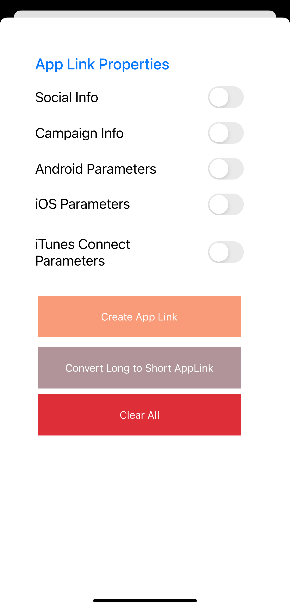

## AGC App Linking Xamarin iOS Plugin - Demo

##  Introduction

This demo project is an example to demonstrate the features of the AGC App Linking Xamarin iOS Plugin.

##  Installation

**Huawei.Agconnect.iOS.Applinking** is available on [NuGet](https://www.nuget.org/packages/Huawei.Agconnect.Applinking).

In the Solution Explorer panel, right click on the solution name and select Manage NuGet Packages. Search for [Huawei.Agconnect.iOS.Applinking](https://www.nuget.org/packages/Huawei.Agconnect.iOS.Applinking) and install the package into your Xamarin.Android projects.

### Environment Setting

 - Visual Studio for Mac or Visual Studio - The latest version of Visual Studio for Mac or Visual Studio should be installed and configured on the development computer. 
  - A Mac with macOS High Sierra 10.13 or above required for developing a Xamarin.iOS application, and when using Visual Studio you must be connected to a Xamarin.iOS build host.
  - Xcode and iOS SDK - Apple's Xcode and the latest iOS API need to be installed and configured on the developer's computer. The latest stable version is usually recommended.
 - An Apple ID. If you don't have an Apple ID already you can create a new one at https://appleid.apple.com. It's necessary to have an Apple ID for installing and signing into Xcode.

### Enable App Linking 

**Step 1:** Sign in to [AppGallery Connect](https://developer.huawei.com/consumer/en/service/josp/agc/index.html) and select your project from **My Projects**.  Then go to **Grow > App Linking** tab. On the page that is displayed, click Enable now in the upper right corner.

**Step 2:** The App Linking service uses HUAWEI Analytics to automatically collects and analyzes data about users taps on App Linking. As long as your app integrates HUAWEI Analytics Kit and the App Linking SDK, you can view all relevant analytical data in AppGallery Connect. For details, please refer to [Enabling HUAWEI Analytics](#https://developer.huawei.com/consumer/en/doc/development/HMSCore-Guides/service-enabling-0000001050745155). 

**Step 3:**  Check whether the received link is a link of App Linking and whether the app can process the link

- If Using Universal Link: [Allowing Apps and Websites to Link to Your Content](https://developer.apple.com/documentation/xcode/allowing_apps_and_websites_to_link_to_your_content#topics)

- If using Custom Scheme: [Defining a Custom URL Scheme for Your App](https://developer.apple.com/documentation/xcode/allowing_apps_and_websites_to_link_to_your_content/defining_a_custom_url_scheme_for_your_app)

### Place your agconnect-services.plist file inside the project

**Step 1:** Sign in to [AppGallery Connect](https://developer.huawei.com/consumer/en/service/josp/agc/index.html) and select your project from **My Projects**. 
Then go to **Project Settings** tab. On the page that is displayed, click `agconnect-services.plist` button.

**Step 2:** Once you download your `agconnect-services.plist` file, place it under the root of the demo project. And set the build action as **"BundleResource"**.

**Step 3:** Bundle identifier in the `agconnect-services.plist` and the  **Info.plist** file should be the same.

## 3. Configuration

### Configuring the Free Provisioning Profile

To use free provisioning to deploy an app to a device and to use specific entitlements follow these steps:

**Step 1.** Use Xcode to create the necessary signing identity (developer certificate and private key) and provisioning profile (containing an explicit App ID and the UDID of a connected iOS device).

**Step 2.** Use the signing identity and provisioning profile created by Xcode in Visual Studio for Mac or Visual Studio 2019 to deploy your Xamarin.iOS application.

**Step 2.** Open the Properties of the demo application. Select **iOS Bundle Signing** and select your profile.

### Set Keychain Access in the Entitlements.plist

You need to enable the Keychain Sharing capability in Visual Studio or App Linking failed to sends reports to the App Gallery Console. 

**Step 1:** Click and open the **Entitlements.plist** file. 

**Step 2:** Select the Entitlements tab below and check **Enable Keychain** in the Keychain section.

**Note:** A free or paid provisioning profile is required to use entitlements. 

### Run & debug your application

You can now run your application and it should automatically start up on your mobile device.

##  Licensing and Terms

AGC App Linking Xamarin iOS Plugin - Demo uses the Apache 2.0 license.